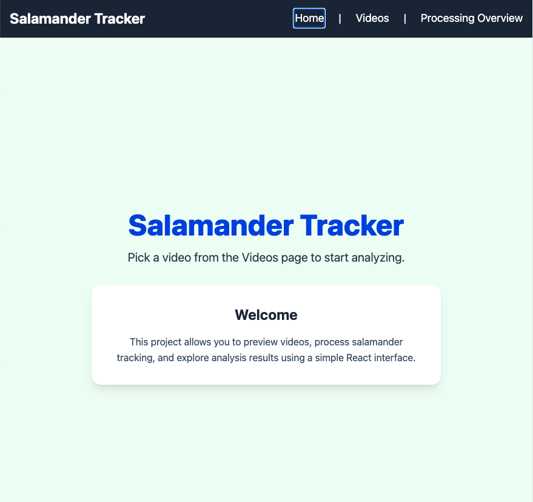
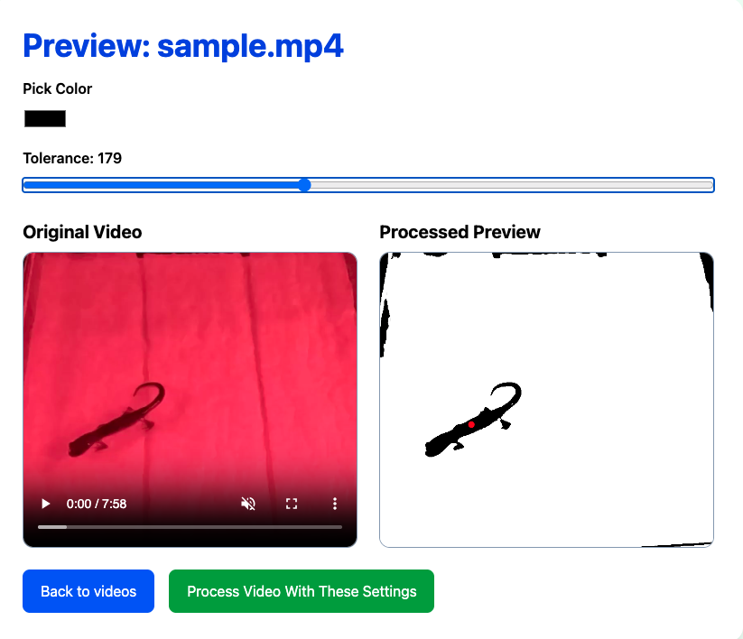
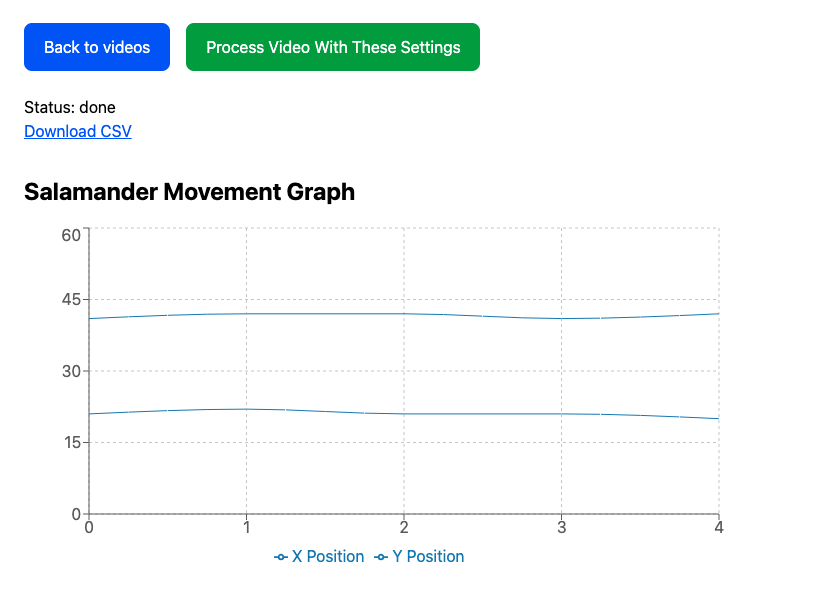

# Salamander Tracking Project

## Team Members

- Ebtisam Abdelkerim
- Azeb Tesfay

## Project Overview

This application tracks salamander movement in videos. Users can select a target color and tolerance, preview the binarized result, detect the largest connected region, generate a CSV file of centroid positions, and view a movement graph.

## Technologies

- React
- React Router
- Tailwind CSS
- Recharts
- Node.js / Express
- Java / Maven / JCodec

## Required Software

Install the following before running the project:

### Node.js

```bash
node -v
npm -v
```

### Java 21

```bash
java --version
```

### Maven

```bash
mvn -v
```

### FFmpeg (macOS)

```bash
brew install ffmpeg
ffmpeg -version
```

## Setup

### Frontend

```bash
npm install
npm install react-router-dom recharts
npm run dev
```

### Backend

```bash
cd server
npm install
node index.js
```

Create a `.env` file:

```env
VIDEO_DIR=../videos
OUTPUT_DIR=../processor/sampleOutput
PROCESSOR_JAR=../processor/target/centroid-finder-1.0-SNAPSHOT-jar-with-dependencies.jar
PORT=3000
```

### Java Processor

```bash
cd processor
mvn clean package
```

## Running the Project

### Terminal 1

```bash
cd processor
mvn clean package
```

### Terminal 2

```bash
cd server
node index.js
```

### Terminal 3

```bash
npm run dev
```

Open:

```text
http://localhost:5173
```

## Color Palette

- Blue: `#2563EB`
- White: `#FFFFFF`
- Slate Background: `#F1F5F9`
- Slate Cards: `#E2E8F0`

## Custom Feature: Movement Graph

After processing is complete, the application loads the generated CSV and displays a graph of the salamander's X and Y positions over time. This allows users to visually analyze movement instead of reading raw CSV values.

### How to Use

1. Select a video.
2. Choose a target color and tolerance.
3. Preview the binarized image.
4. Click **Process Video With These Settings**.
5. Wait for processing to finish.
6. Download the CSV.
7. View the movement graph.

## Screenshots

(Optional)

```markdown





```
